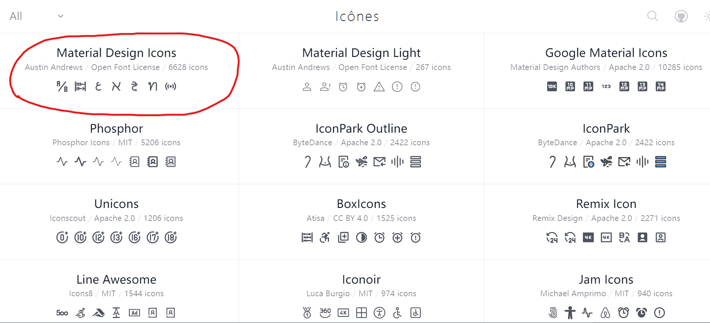
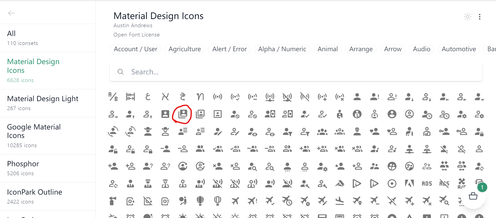
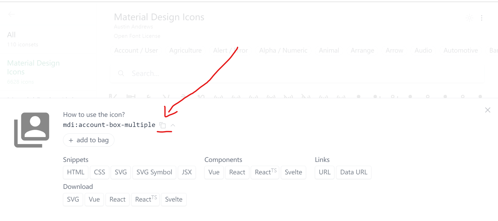
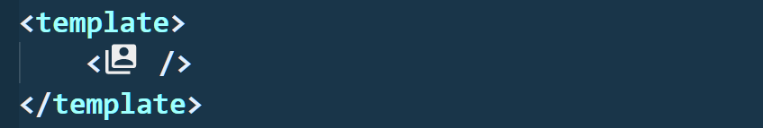
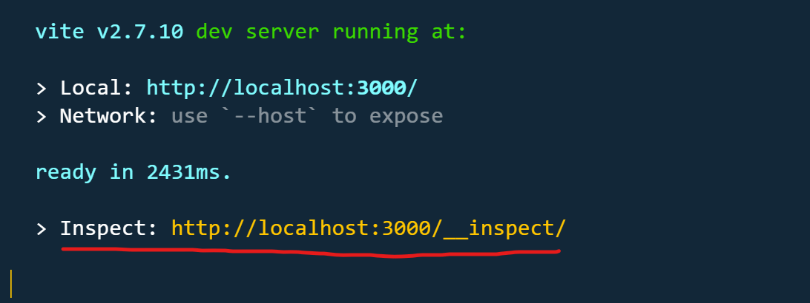
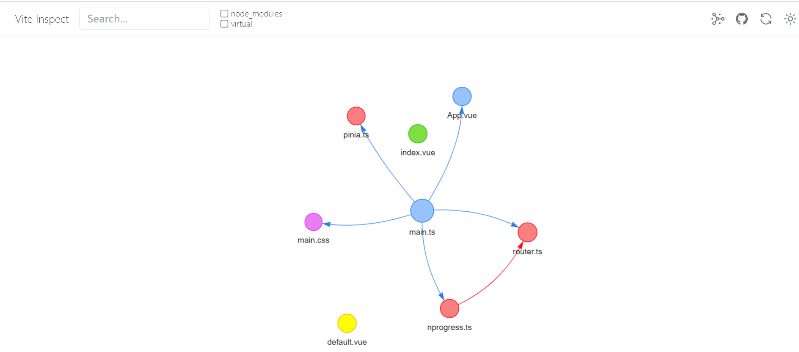
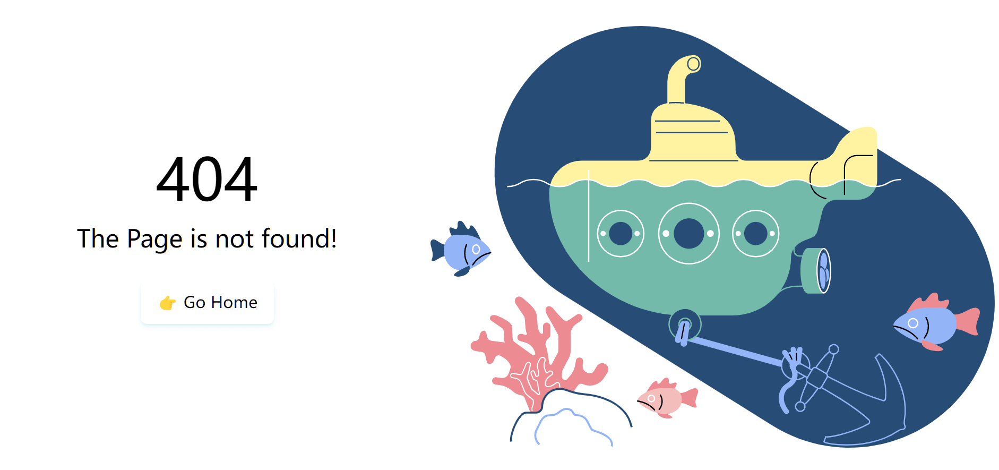
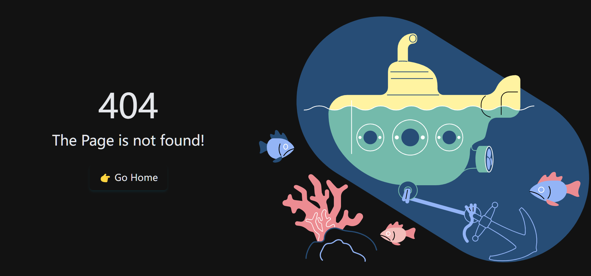

<div align="center">
    
    <h1>tov-template</h1>
    <p>vite + vue3 + ts 开箱即用现代开发模板</p>
</div>

<br />
<br />

## 特点 🐳

1. Vite 的
2. Vue3 的
3. 文件路由
4. 布局系统
5. Mock 支持
6. Api 自动引入
7. 组件自动引入
8. 图标自动引入
9. VueUse 支持
10. TypeScript 的
11. Windi CSS 的
12. 暗黑模式支持
13. SWR 请求支持
14. pinia 状态管理
15. pnpm 包管理器
16. 跳转进度条支持
17. Inspect 调试支持
18. 插件自动加载支持
19. Vitest 单元测试支持
20. 支持 Markdown 渲染
21. 路径别名 `~` 支持
22. 命令行自动创建与删除
23. i18n 国际化支持
24. 漂亮的 404 页 支持
25. tsx 支持
26. gzip 资源压缩支持
27. 环境变量配置支持
28. 统一的代码规范与风格支持
29. 生产环境自动移除开发日志
30. defineOptions 支持

<br />
<br />

## 克隆模板 🦕

1. Github

```shell
git clone git@github.com:dishait/tov-template.git
```

2. Gitee

```shell
git clone git@gitee.com:dishait/tov-template.git
```

3. degit

```shell
npx degit https://github.com/dishait/tov-template#main
```

4. 新的 `Github` 仓库 👉 [Use this template](https://github.com/dishait/tov-template/generate)

<br />
<br />
<br />

## `node` 版本推荐 🐎

因为该模板完全面向现代，所以推荐大家使用 `node` 当前的长期维护版本 `v16`， 大于 `v16.13.1` 即可。

<br />
<br />
<br />

## 使用 🐂

> 该模板不限定大家使用某一特定的包管理器，npm，yarn 和 pnpm 都行。同时注意 npm 的版本应该尽量的新。

强烈推荐大家使用更快更合理的 `pnpm` 包管理器 👉 [安装教程](https://pnpm.io/zh/installation)

1. 安装依赖

```shell
pnpm install

# 或者 npm install
# 或者 yarn
```

2. 开发

```shell
pnpm dev

# 或者 npm run dev
# 或者 yarn dev

# 开启 host
pnpm dev:host

# 或者 npm run dev:host
# 或者 yarn dev:host

# 自动打开浏览器
pnpm dev:open

# 或者 npm run dev:open
# 或者 yarn dev:open
```

3. 预览

```shell
pnpm preview

# 或者 npm run preview
# 或者 yarn preview

# 开启 host
pnpm preview:host

# 或者 npm run preview:host
# 或者 yarn preview:host

# 自动打开浏览器
pnpm preview:open

# 或者 npm run preview:open
# 或者 yarn preview:open
```

4. 打包

```shell
pnpm build

# 或者 npm run build
# 或者 yarn build
```

5. 单元测试

```shell
pnpm test

# 或者 npm run test
# 或者 yarn test
```

6. 单元测试报告生成

```shell
pnpm coverage

# 或者 npm run coverage
# 或者 yarn coverage
```

7. 样式报告预览

```shell
pnpm analysis

# 或者 npm run analysis
# 或者 yarn analysis
```

8. 样式报告打包

```shell
pnpm analysis:build

# 或者 npm run analysis:build
# 或者 yarn analysis:build
```

9. 类型检查

```shell
pnpm typecheck

# 或者 npm run typecheck
# 或者 yarn typecheck
```

10. 自动创建

```shell
pnpm auto:create

# 或者 npm run auto:create
# 或者 yarn auto:create
```

11. 自动移除

```shell
pnpm auto:remove

# 或者 npm run auto:remove
# 或者 yarn auto:remove
```

12. 依赖更新

```shell
# 安全版本更新
pnpm deps:fresh

# 或者 npm run deps:fresh
# 或者 yarn deps:fresh

# 主版本更新，可能是破坏性更新，谨慎使用，做好测试
pnpm deps:fresh:major

# 或者 npm run deps:fresh:major
# 或者 yarn deps:fresh:major

# 次版本更新，可能是破坏性更新，谨慎使用，做好测试
pnpm deps:fresh:minor

# 或者 npm run deps:fresh:minor
# 或者 yarn deps:fresh:minor

# 补丁版本更新
pnpm deps:fresh:patch

# 或者 npm run deps:fresh:patch
# 或者 yarn deps:fresh:patch
```

```shell
# 以上命令仅对包信息 package.json 进行写入，需要重新执行包安装命令
pnpm i

# 或者 npm i
# 或者 yarn
```

13. 代码规范校验

```shell
pnpm lint

# 或者 npm run lint
# 或者 yarn lint

# 校验时修复

pnpm lint:fix

# 或者 npm run lint:fix
# 或者 yarn lint:fix
```

<br />
<br />

## 动机 🐗

为什么要做这个 **模板** 呢？

1. 为下次开发节省浪费在配置上的时间
2. 结合主流插件整合现代开发架构，提高开发效率

<br />
<br />

## 使用场景 🐻

什么时候你应该用?

1. 不想浪费时间在项目配置上
2. 希望尝试用更现代的方式开发 `web` 应用，提高开发效率

<br />
<br />

## 启发 🐃

该模板受 **[vitesse](https://github.com/antfu/vitesse)** 启发，如果你有 `SSG` 的场景，那么推荐你始终使用 **[vitesse](https://github.com/antfu/vitesse)**。

<br />
<br />

## 组织 🦔

欢迎关注 **帝莎编程**

- [官网](http://dishaxy.dishait.cn/)
- [Gitee](https://gitee.com/dishait)
- [Github](https://github.com/dishait)
- [网易云课堂](https://study.163.com/provider/480000001892585/index.htm?share=2&shareId=480000001892585)

<br />
<br />

## 详情 🐳

### [1. Vite 的](https://cn.vitejs.dev/)

该模板采用 **[vite](https://cn.vitejs.dev/)** 作为构建工具，你可以在根目录下的 `vite.config.ts` 对项目的构建进行配置。

对于众多主流插件的引入和繁杂配置已经整合到根目录下的预设 `presets` 中，大多数情况下你是不需要重新对它们进行配置的。

<br />

### [2. Vue3 的](https://v3.cn.vuejs.org/)

<br />

### [3. 文件路由](https://github.com/posva/unplugin-vue-router)

目录结构即路由。

eg:

- `src/pages/index.vue` => `/`
- `src/pages/about.vue` => `/about`
- `src/pages/users/index.vue` => `/users`
- `src/pages/users/profile.vue` => `/users/profile`
- `src/pages/users/[id].vue` => `/users/:id`
- `src/pages/[user]/settings.vue` => `/:user/settings`
- `src/pages/[...notFound].vue` => 404 路由

具体可见 👉 [unplugin-vue-router](https://github.com/posva/unplugin-vue-router)

<br />

### [4. 布局系统](https://github.com/dishait/vite-plugin-vue-meta-layouts)

#### 默认布局

`src/layouts/default.vue` 将作为默认布局。

```html
<!-- src/layouts/default.vue -->
<template>
	我是默认布局
	<router-view />
	<!-- 页面视图出口 -->
</template>
```

此时 `src/pages/index.vue`

```html
<!-- src/pages/index.vue -->
<template>
	<div>我是首页</div>
</template>
```

路由到 `/`时，页面将渲染

```html
我是默认布局 我是首页
```

此时 `src/pages/about.vue`

```html
<!-- src/pages/about.vue -->
<template>
	<div>我是关于页</div>
</template>
```

路由到 `/about` 时，页面将渲染

```html
我是默认布局 我是关于页
```

<br />

#### 非默认布局

随便创建一个 `src/layouts/custom.vue`

```html
<!-- src/layouts/custom.vue -->
<template>
	我是非默认布局custom
	<router-view />
	<!-- 页面视图出口 -->
</template>
```

此时 `src/pages/index.vue` 内

```html
<!-- src/pages/index.vue -->
<template>
	<div>我是首页</div>
</template>

<!-- 添加自定义块 👇 -->
<route lang="yaml"> meta: layout: custom </route>
```

此时路由到 `/`, 页面将渲染

```html
我是非默认布局custom 我是首页
```

具体可见 👉 [vite-plugin-vue-meta-layouts](https://github.com/dishait/vite-plugin-vue-meta-layouts)

<br />

### [5. Mock 支持](https://github.com/vbenjs/vite-plugin-mock)

在根目录下的 `mock` 目录下，可以在模块中导出默认的 `api` 资源。

例如 `mock/test.ts` 内导出

```ts
import { MockMethod } from 'vite-plugin-mock'
export default [
	{
		url: '/api/get',
		method: 'get',
		response: () => {
			return {
				code: 0,
				data: {
					name: 'vben',
				},
			}
		},
	},
] as MockMethod[]
```

在 `src` 中就可以进行模拟请求。

```html
<script setup lang="ts">
	import { useRequest } from 'vue-request'
	// 请求接口 /api/get
	const { data, loading, error } = useRequest('/api/get')
</script>

<template>
	<div>data: {{data}}</div>
	<div>loading: {{loading}}</div>
	<div>error: {{error}}</div>
</template>
```

这里用到 [vue-request](https://cn.attojs.org/) 去做请求，不过因为该 `mock` 拦截的是一整个接口，所以换成 `axios` 等请求库也是可以的。

更多 `mock` 设置可见 👉 [vite-plugin-mock](https://github.com/vbenjs/vite-plugin-mock)

<br />

### [6. Api 自动引入](https://github.com/antfu/unplugin-auto-import)

原本 `vue` 的 `api` 需要自行 `import`。

```ts
import { ref, computed } from 'vue'
const count = ref(0)
const doubled = computed(() => count.value * 2)
```

现在可以直接使用。

```ts
const count = ref(0)
const doubled = computed(() => count.value * 2)
```

而且上边的 `api` 是按需自动引入的。

目前模板支持自动引入 `api` 的库列表包括:

1. vue
2. pinia
3. vueuse
4. vue-i18n
5. vue-router

当然还有项目中的自动引入，只需要满足以下规范即可。

1. `src/composables` 的导出将被按需自动引入。

例如有个 `src/composables/foo.ts`

```ts
// default 导出
export default 1000
```

此时就不再需要 `import`了

```html
<script setup lang="ts">
	console.log(foo) // 输出 1000
</script>

<template>
	<div @click="store.inc()">{{store.counter}}</div>
</template>
```

1. `src/stores` 的导出将被按需自动引入。

例如有个 `src/stores/counterStore.ts`

```ts
// default 导出
export default defineStore('counter', {
	state() {
		return {
			counter: 1,
		}
	},
	actions: {
		inc() {
			this.counter++
		},
	},
})
```

此时就不再需要 `import`了

```html
<script setup lang="ts">
	const store = counterStore()
</script>

<template>
	<div @click="store.inc()">{{store.counter}}</div>
</template>
```

具体可见 👉 [unplugin-auto-import](https://github.com/antfu/unplugin-auto-import)。

<br />

### [7. 组件自动引入](https://github.com/antfu/unplugin-auto-import)

原来需要 `import`

```html
<!-- src/pages/index.vue -->
<script setup lang="ts">
	import Hello from '../components/Hello.vue'
</script>

<template>
	<Hello />
</template>
```

现在只要在 `src/components` 下定义的组件都将会按需引入，即 `import` 是不需要的。

```html
<!-- src/pages/index.vue -->
<template>
	<Hello />
</template>
```

同时流行组件库自动引入也是支持的，例如 `Naive ui`。

只需安装依赖。

```shell
pnpm add naive-ui

# 或者 npm i naive-ui
# 或者 yarn add naive-ui
```

即可在模板中使用。

```html
<!-- src/pages/index.vue -->
<template>
	<n-button type="success">Success</n-button>
</template>
```

目前支持的组件库有:

[vant](https://github.com/youzan/vant)
[idux](https://github.com/IDuxFE/idux)
[devui](https://github.com/DevCloudFE/vue-devui)
[quasar](https://github.com/quasarframework/quasar)
[varlet](https://github.com/varletjs/varlet)
[inkline](https://github.com/inkline/inkline)
[vuetify](https://github.com/vuetifyjs/vuetify)
[naive-ui](https://github.com/TuSimple/naive-ui)
[primevue](https://github.com/primefaces/primevue)
[layui-vue](https://gitee.com/layui/layui-vue)
[view-design](https://iviewui.com/)
[arco-design](https://github.com/arco-design/arco-design)
[element-plus](https://github.com/element-plus/element-plus)
[ant-design-vue](https://github.com/vueComponent/ant-design-vue)
[@headlessui/vue](https://github.com/tailwindlabs/headlessui)
[tdesign-vue-next](https://github.com/Tencent/tdesign-vue-next)
[@vueuse/components](https://github.com/vueuse/vueuse/tree/main/packages/components)

具体可见 👉 [unplugin-vue-components](https://github.com/antfu/unplugin-vue-components)

<br />

### [8. 图标自动引入](https://github.com/antfu/unplugin-auto-import)

可前往 👉 [icones](https://icones.netlify.app/)，随意选择点击进入其中一个图标库



再点击选择其中一个喜欢的图标



复制其名称



在模板中即可直接用组件的形式直接使用，注意加上前缀 `i-`。

```html
<template>
	<i-mdi:account-box-multiple />
</template>
```

保存后等待自动下载该图标库后，就可以在页面中看到对应图标。

注意自动下载图标需要 `pnpm` 包管理器支持，如果你是其他包管理器需要手动安装图标集 👇👇👇

图标集名称为 `@iconify/` 加 `:` 前缀，例如上边的图标是 `mdi:account-box-multiple`，图标集名称就为 `@iconify/mdi`。

```shell
npm i @iconify/mdi -D

# 或者 yarn add @iconify/mdi -D
```

同时推荐你使用 `vscode` 插件 [Iconify IntelliSense](https://marketplace.visualstudio.com/items?itemName=antfu.iconify)。

该插件会在模板中显示图标的预览。就像这样 👇

```html
<!-- 模板中代码 -->
<template>
	<i-mdi:account-box-multiple />
</template>
```

将在 `vscode` 中得到图标预览



具体可见 👉 [unplugin-icons](https://github.com/antfu/unplugin-icons)

<br />

### [9. VueUse 支持](https://vueuse.org/)

`VueUse` 是一个超级强的 `hooks` 库，例如你要获取鼠标位置，只需要这样 👇

```html
<script setup lang="ts">
	// useMouse 被自动按需引入了，不需要import
	const { x, y } = useMouse()
</script>

<template>
	<div>x坐标 {{x}}</div>
	<div>y坐标 {{y}}</div>
</template>
```

具体可见 👉 [VueUse](https://vueuse.org/)

<br />

### [10. TypeScript 的](https://www.tslang.cn/)

不需要重新配置，直接用 `ts` 书写就行了。

<br />

### [11. Windi CSS 的](https://cn.windicss.org/)

`Windi CSS` 是一个开发中速度更快的 `原子css` 库。

直接在模板中用就行了，不需要配置。

```html
<template>
	<div class="bg-red-500 text-white">我是红色背景的白色文本</div>
	<template></template
></template>
```

上述模板将渲染红色背景白色的字。

同时支持 [属性化模式](https://cn.windicss.org/features/attributify.html#attributify-mode)，即可以用简写。该功能默认关闭，可在 `windi.config.ts` 中 设置 `attributify` 为 `true` 开启。

```html
<template>
	<div text="white" bg="red-500">我是红色背景的白色文本</div>
	<template></template
></template>
```

这在调整边距尺寸以及等方面可以减少代码量。

同时预设 [排版](https://cn.windicss.org/plugins/official/typography.html) 插件，解决简单的布局困难问题。

当然也支持 [可视化分析器](https://cn.windicss.org/features/analyzer.html) 生成 `原子css` 报告.

在终端中输入命令，即可看到报告

```shell
pnpm analysis

# 或者 npm run analysis
# 或者 yarn analysis
```

或者打包输出该报告

```shell
pnpm analysis:build

# 或者 npm run analysis:build
# 或者 yarn analysis:build
```

具体可见 👉 [Windi CSS](https://cn.windicss.org/)

<br />

### [12. 暗黑模式支持](https://cn.windicss.org/features/dark-mode.html#dark-mode)

暗黑模式由 `Windi CSS` 的 `暗黑模式` 和 `VueUse` 实现。

`src/composables` 目录用来存储 `composition-api` 模块。

该目录下预设了`useDarks` 模块，该模块导出 `isDark` 和 `toggleDark` 用来显示和切换暗黑模式。

```ts
// src/composables/useDarks.ts

// vueuse的 api 会自动按需引入，无需import
export const isDark = useDark()
export const toggleDark = useToggle(isDark)

export const useDarks = () => ({ isDark, toggleDark })
```

模板中即可直接用

```html
<script setup lang="ts">
	import { useDarks } from '../composables/useDarks'

	const { isDark, toggleDark } = useDarks()
</script>

<template>
	<div m="6">Hello，This is the tov template！！</div>
	<div m="6" cursor="pointer" @click="toggleDark()">
		light: {{ isDark }} click me!!
	</div>
</template>
```

具体可见 👉 [暗黑模式](https://cn.windicss.org/features/dark-mode.html#dark-mode)

<br />

### [13. SWR 请求支持](https://cn.attojs.org/)

SWR 是更现代的请求方式，具体可见文章 👉 [SWR](https://zhuanlan.zhihu.com/p/89570321)。

而 [vue-request](https://cn.attojs.org/) 是一个 `SWR` 的 `Vue` 版本请求库。

你可以这样用，例如请求 `/api/test`

```html
<script setup lang="ts">
	import { useRequest } from 'vue-request'
	const { data, loading, error } = useRequest('/api/test')
</script>

<template>
	<div>data: {{data}}</div>
	<div>error: {{error}}</div>
	<div>loading: {{loading}}</div>
</template>
```

所有基本的数据，状态和缓存都帮你搞定了，不需要重新封装。

具体可见 👉 [vue-request](https://cn.attojs.org/)

<br />

### [14. pinia 状态管理](https://pinia.vuejs.org/)

`pinia` 是下一代的状态管理库，比 `vuex` 更简单，`ts` 支持更好。

你可以在 `src/stores` 中进行状态的定义。

例如创建 `src/stores/counter.ts` 👇

```ts
// src/stores/counter.ts
import { defineStore } from 'pinia'

export const useCounterStore = defineStore('counter', {
	state: () => {
		return { count: 0 }
	},
	actions: {
		inc() {
			this.count++
		},
	},
})
```

定义完后在 `setup` 中直接使用即可

```html
<!-- src/pages/index.vue -->
<script setup lang="ts">
    import { useCounterStore } from "../stores/counter"
    const Counter = useCounterStore()
<script>

<template>
    <div @click="Counter.inc">{{Counter.count}}</div>
</template>
```

更多具体使用可见 👉 [pinia](https://pinia.vuejs.org/)

<br />

### [15. pnpm 包管理器](https://pnpm.io/zh/)

`pnpm` 是非常优秀的包管理器，更快、更节省空间、更合理。

具体可见 👉 [pnpm](https://pnpm.io/zh/)

<br />

### [16. 跳转进度条支持](https://github.com/rstacruz/nprogress)

跳转进度条由 `nprogress` 实现，可在`src/styles/main.css` 中调整配色。

```css
/** src/styles/main.css **/

/** 省略其他样式 **/
#nprogress .bar {
	@apply bg-purple-700 bg-opacity-75; /** 配色 **/

	position: fixed;
	z-index: 1031;
	top: 0;
	left: 0;

	width: 100%;
	height: 2px;
}
```

关于 `@apply` 由 [Windi Css apply 指令](https://cn.windicss.org/features/directives.html#apply) 实现。

具体可见 👉 [nprogress](https://github.com/rstacruz/nprogress)

<br />

### [17. Inspect 调试支持](https://github.com/antfu/vite-plugin-inspect)

启动项目

```shell
pnpm dev

# 或者 npm run dev
# 或者 yarn dev
```

可以看到一个 `url`



先进入 `http://localhost:3000`，再进入 `http://localhost:3000/__inspect/` 即可获得依赖图谱。



通过顶部的一些按钮还可以调整依赖呈现。

具体可见 👉 [vite-plugin-inspect](https://github.com/antfu/vite-plugin-inspect)

<br />

### [18. 插件自动加载支持](https://github.com/dishait/vite-plugin-use-modules)

只需要在 `src/modules` 中的模块里导出默认函数即可。

例如 `pinia`，只需要这样做。

```ts
// src/modules/pinia.ts

import { App } from 'vue'

// 导出 default 接口
export default (app: App) => app.use(createPinia())
```

或者 `vue-router`

```ts
// src/modules/router.ts

import { App } from 'vue'

// 省略各种配置

// 导出 default 接口
export default (app: App) => app.use(router)
```

当然 `pinia` 和 `vue-router` 已经预设好了，你不需要重新关注他们。

具体可见 👉 [vite-plugin-use-modules](https://github.com/dishait/vite-plugin-use-modules)

<br />

### [19. Vitest 单元测试支持](https://vitest.dev/guide/#configuring-vitest)

在 `src/test` 目录中可以书写单元测试。

```ts
import { it, describe, expect, assert } from 'vitest'

describe('suite name', () => {
	it('foo', () => {
		expect(1 + 1).toEqual(2)
		expect(true).to.be.true
	})

	it('bar', () => {
		assert.equal(Math.sqrt(4), 2)
	})

	it('snapshot', () => {
		expect({ foo: 'bar' }).toMatchSnapshot()
	})
})
```

然后在终端中输入命令即可测试

```shell
pnpm test

# 或者 npm run test
# 或者 yarn test
```

或者生成报告

```shell
pnpm coverage

# 或者 npm run coverage
# 或者 yarn coverage
```

具体可见 👉 [Vitest](https://vitest.dev/guide/#configuring-vitest)

<br />

### [20. 支持 Markdown 渲染](https://github.com/antfu/vite-plugin-md)

`markdown` 渲染可以用来书写一些简单的说明。

只需要把 `src/pages` 目录下的页面后缀由 `.vue` 改为 `.md`，然后再改为 `markdown` 语法即可。

例如 `src/pages/about.md`

```md
## About Page

> The page is markdown file
```

当你路由到 `/about` 后即可看到对应的 `markdown` 渲染。

具体可见 👉 [vite-plugin-md](https://github.com/antfu/vite-plugin-md)

<br />
<br />

### 21. 路径别名 `~` 支持

`~` 路径将被导向项目的 `src` 目录。

```html
<!-- src/pages/index.vue -->
<script lang="ts" setup>
	import { useDarks } from '~/composables/dark'

	// 等价于
	// import { useDarks } from "../composables/dark"
</script>
```

<br />
<br />

### 22. 命令行自动创建与删除

只要输入 👇，即可创建一个标准的页面或组件

```shell
pnpm auto:create

# 或者 npm run auto:create
# 或者 yarn auto:create
```

当然也可以进行删除 👇

```shell
pnpm auto:remove

# 或者 npm run auto:remove
# 或者 yarn auto:remove
```

<br />
<br />

### [23. i18n 国际化支持](https://github.com/intlify/bundle-tools/tree/main/packages/vite-plugin-vue-i18n)

在日常的业务当中，可能会存在一些需要国际化的场景。那么只需要在根目录下的 `locales` 中定义不同语言的 `yml` 即可在项目中做到开箱即用的国际化支持。

比如 `locales/en.yml` 中用来定义需要国际化支持的英文内容。

```yml
# locales/en.yml
# English

index: index
about: about
not-found: Notfound
```

又如 `locales/zh-CN.yml` 中用来定义需要国际化支持的中文内容。

```yml
# locales/zh-CN.yml
# 中文

index: 主页
about: 关于
not-found: 未找到页面
```

此时在组件中即可这样用 👇

```html
<script setup>
	// 该api是全局按需引入的，所以可以直接用
	// t 用来绑定特定的语块
	const { t, locale } = useI18n()

	const toggleLocale = () => {
		// locale.value 用来表示当前所属语言，可修改进行语言切换
		locale.value = locale.value === 'zh-CN' ? 'en' : 'zh-CN'
	}
</script>

<template>
	<div m="6" cursor="pointer" @click="toggleLocale()">
		language: {{ t('index') }} click me!!
	</div>
</template>
```

更详细的说明可见用到的 `vite 插件` 👉 [@intlify/vite-plugin-vue-i18n](https://github.com/intlify/bundle-tools/tree/main/packages/vite-plugin-vue-i18n) 与 `vue插件` [vue-i18n](https://github.com/intlify/vue-i18n-next)。

另外 `yml` 是目前前端中流行的配置文件格式，语法可见阮一峰先生的 👉 [YAML 语言教程](http://www.ruanyifeng.com/blog/2016/07/yaml.html)。

`vscode` 插件推荐:

- 多合一的 `i18n` 支持 [i18n Ally](https://marketplace.visualstudio.com/items?itemName=Lokalise.i18n-ally)

<br />
<br />

### 24. 漂亮的 `404` 页支持

在日常业务中，当用户访问不存在的页面时，应该给到我们的用户一个不存在的信息提示，而这个提示的页面就是 `404` 页。

你可以随便访问一个不存在的页面，例如 `/bucunzai`



当然还有暗黑模式适应。



也支持简单的响应式适应。例如移动端浏览器上会有正确的显示。

当然如果这个 `404` 的封面不符合你的口味，那么可以在 `pages/[...notFound].vue` 中修改 `img` 标签的 `src`。默认是 `32.svg`，支持 `1 ~ 33` 的 `svg`。

例如，默认 👇

```html
<!-- 省略各种代码 -->
<template>
	
</template>
```

修改 `/notFound/32.svg` 为 `/notFound/33.svg`

```html
<!-- 省略各种代码 -->
<template>
	
</template>
```

即可切换封面为 👇


<br />
<br />

### 25. [`tsx` 支持](https://github.com/vitejs/vite/tree/main/packages/plugin-vue-jsx)

只需要 `tsx` 文件放在 `src/components` 下，即可直接在模板中使用。

例如你有一个 `src/components/foo.tsx` 文件，那么即可直接在模板中使用。

```tsx
// src/components/foo.tsx
export default defineComponent({
	render() {
		return <div>Test</div>
	},
})
```

```html
<template>
	<foo />
</template>
```

具体可见 👉 [@vitejs/plugin-vue-jsx](https://github.com/vitejs/vite/tree/main/packages/plugin-vue-jsx)

<br />
<br />

### 26. [`gzip` 资源压缩支持](https://github.com/vbenjs/vite-plugin-compression)

生产环境下开箱即用的 `gzip` 资源压缩，无需配置。

具体可见 👉 [vite-plugin-compression](https://github.com/vbenjs/vite-plugin-compression)

<br />
<br />

### 27. [环境变量配置支持](https://cn.vitejs.dev/guide/env-and-mode.html)

根目录下有三个环境变量配置文件 `.env`，`.env.development` 和 `.env.production` 用来对项目进行配置。

<br />
<br />

### 28. 统一的代码规范与风格支持

由 [eslint](https://github.com/eslint/eslint) 提供的代码规范校验，使用 [prettier](https://github.com/prettier/prettier) 统一代码风格。

由 [husky](https://github.com/typicode/husky) + [lint-staged](https://github.com/okonet/lint-staged) 提供的 `commit` 时校验。

<br />
<br />

### 29. [生产环境自动移除开发日志](https://github.com/dishait/vite-plugin-removelog)

生产环境下 `console.log`，`console.warn` 与 `console.error` 等日志会被自动移除掉，以避免开发时日志的泄漏。

具体可见 👉 [vite-plugin-removelog](https://github.com/dishait/vite-plugin-removelog)

<br />
<br />

### 30. [defineOptions 支持](https://github.com/sxzz/unplugin-vue-macros/blob/main/README-zh-CN.md)

```html
<script setup lang="ts">
// 定义额外的 options
defineOptions({
  name: 'Foo'
})
</script>
```

具体可见 👉 [unplugin-vue-macros](https://github.com/sxzz/unplugin-vue-macros/blob/main/README-zh-CN.md)

<br />
<br />
<br />

## License

Made with [markthree](./LICENSE)

Published under [MIT License](./LICENSE).

<br />
